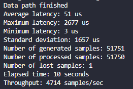
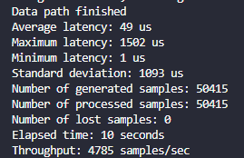
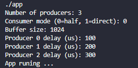

# Circular Buffer Producer–Consumer

## Description

This project implements a producer–consumer system in C using:
- a circular buffer
- pthreads
- mutexes and condition variables

Multiple producer threads generate data continuously and push it into a shared buffer. A single consumer thread processes the data.

---

## Objective

- Simulate a real-time data pipeline
- Measure latency, throughput, and data loss
- Compare two consumer strategies:
  - direct consumption
  - batch consumption (half-buffer mode)

---

## How it works

### Producer
- Generates data periodically
- Pushes data into the circular buffer
- Multiple producers can run simultaneously

### Consumer
- Only one consumer thread
- Waits for data using a condition variable
- Processes data from the buffer

---

## Consumer modes

### Direct mode (`mode = 1`)

The consumer processes all available data immediately as soon as it wakes up.

---

### Half mode (`mode = 0`)

The consumer waits until the buffer reaches at least half capacity before processing in batches.

---

### How to run the code

The application is interactive and asks for configuration parameters at runtime:

Example:

---

### Compilation

To build the project:

make

This compiles the source code and generates the executable:

./app

---

### Run

To run the program:

make run

You will be prompted to enter:

- Buffer size
- Number of producers
- Producer delay (per producer)
- Consumer mode (0 = half, 1 = direct)

To Stop the program use:

Ctrl + C

---

### Tests

To run unit tests:

make test

This builds and executes the test runner:

./test_runner

---

### Clean

To remove compiled files and binaries:

make clean

This deletes:
- object files
- executable (app)
- test binary (test_runner)

---

### Architecture

- multiple producer threads
- single consumer thread
- shared circular buffer
- mutex-protected access
- Data processing statistics, minimum overhead
- condition variable for synchronization

---

### Conclusions

- The system runs without data loss
- Throughput is stable in both consumer modes
- Half-buffer mode does not significantly improve performance in this setup
- Latency variation is mainly caused by OS scheduling and synchronization overhead, not by buffer logic